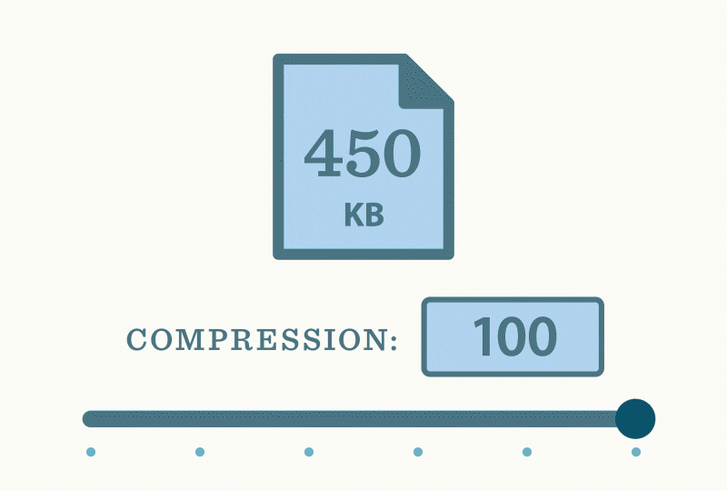

# About Me 

I am a machine learning research engineer with strong interests in machine learning systems that reverage satellite imagery for real-world applications. Specifically AI for conservation and sustainable farming. I am part of the Rwanda Space Agency (RSA) Geospatial team, where I apply machine learning methods on satellite/aerial imagery.

Prior to RSA, I was a machine learning research engineer at [INRIA Grenoble](9https://www.inria.fr/en/inria-centre-university-grenoble-alpes) where my research focused on hyperspectral unmixing and sparse coding. I a masters in Machine Intelligence from [AMMI](https://aimsammi.org/about-ammi-2/) where I worked on deep compression for edge computing and their application in conservation of the environment.  

# Research and Publications 

|  |  |
|--|--|
|  |**Compressed Object Detection**: In this work, we extended pruning, a compression technique which discards unnecessary model connections, and weight sharing techniques for the task of object detection. With our approach we are able to compress a state-of-the-art object detection model by 30.0% without a loss in performance. We also show that our compressed model can be easily initialized with existing pre-trained weights, and thus is able to fully utilize published state-of-the-art model zoos. /<a href="https://github.com/Gedeon-m-gedus/compressed_object_detection">Github</a> /<a href="https://arxiv.org/abs/2102.02896"> arXiv</a> /

