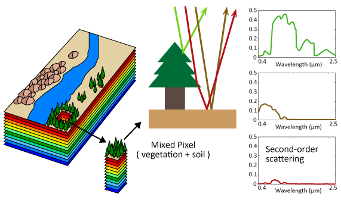

# About Me 

I am a PhD student at Arizona State University advised by [Hannah Kerner](https://hannah-rae.github.io/) focusing on Machine Learning for Remote Sensing. I am part of the Rwanda Space Agency (RSA) Geospatial team, where I contribute on the development of machine learning systems that leverage satellite imagery for real-world applications.

Prior to RSA, I was a machine learning research engineer at [INRIA Grenoble](9https://www.inria.fr/en/inria-centre-university-grenoble-alpes) where my research focused on hyperspectral unmixing and sparse coding. I have a masters in Machine Intelligence from [AMMI](https://aimsammi.org/about-ammi-2/) where I worked with [Georgia Gkioxari](https://gkioxari.github.io/) on deep compression for edge computing and their application in conservation of the environment. 

My [CV/Resume](https://gedeonmuhawenayo.github.io/files/docs/Resume_Gedeon_Muhawenayo_October_2022.pdf)   

# News
- **May 2023:** Co-organized the Machine Learning for Remote Sensing workshop at ICLR 2023 [Workshop [website](https://nasaharvest.github.io/ml-for-remote-sensing/iclr2023/)]

# Research and Publications 

|  |  |
|--|--|
|  |**Entropic Descent Archetypal Analysis for Blind Hyperspectral Unmixing**: We introduced a new algorithm based on archetypal analysis for blind hyperspectral unmixing, assuming linear mixing of endmembers. /<a href="https://github.com/inria-thoth/EDAA">Github</a> /<a href="https://ieeexplore.ieee.org/document/10213413"> IEEE Explore</a> /
|  |**Compressed Object Detection**: In this work, we extended pruning, a compression technique which discards unnecessary model connections, and weight sharing techniques for the task of object detection. With our approach we are able to compress a state-of-the-art object detection model by 30.0% without a loss in performance. We also show that our compressed model can be easily initialized with existing pre-trained weights, and thus is able to fully utilize published state-of-the-art model zoos. /<a href="https://github.com/Gedeon-m-gedus/compressed_object_detection">Github</a> /<a href="https://arxiv.org/abs/2102.02896"> arXiv</a> /

